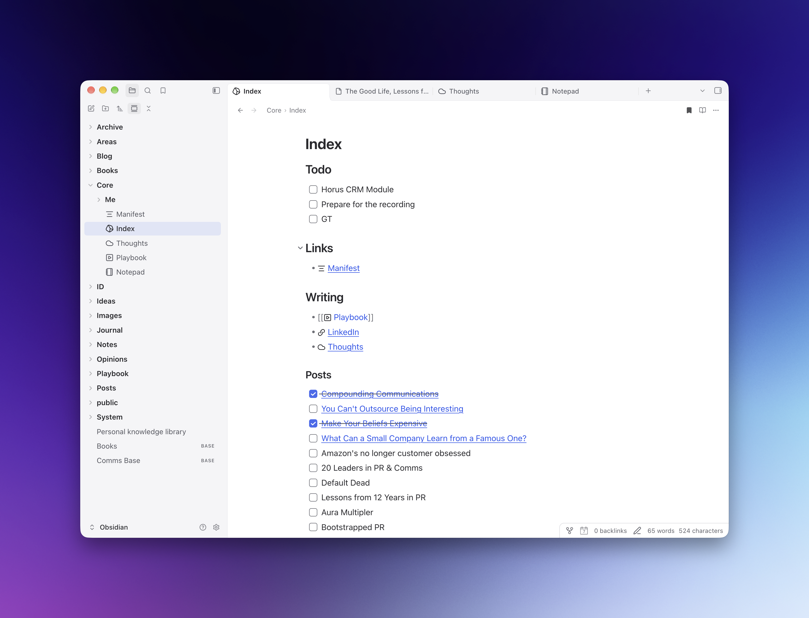

# Lathe

A writing theme for [Obsidian](https://obsidian.md), built on Verso.



## Features

- Light and dark palettes with opaque sidebars, menus, and dialogs.
- Attached tabs with soft curves, clear selection, and backgrounds that match the sidebar.
- Bold folder names and readable file labels.
- Large note titles and consistent spacing after headings in Live Preview and Reading view.
- A compact status bar attached to the bottom-right corner.
- Your chosen fonts and accent color, with brighter accent colors in dark mode.
- Optional controls through Style Settings. No plugins, bundled fonts, or remote assets are required.

## Install

Requires Obsidian **1.13.7 or later**.

1. Download **Lathe.zip** from the [latest release](https://github.com/ymolodtsov/obsidian-lathe/releases/latest).
2. Extract the `Lathe` folder into your vault’s `.obsidian/themes/` directory.
3. In Obsidian, open **Settings → Appearance** and select **Lathe** from the theme dropdown.

The final layout should be:

```text
Your vault/
└── .obsidian/
    └── themes/
        └── Lathe/
            ├── manifest.json
            └── theme.css
```

If Lathe does not appear, restart Obsidian. To update, replace the files in the same folder with the latest release.

You can also download `theme.css` and `manifest.json` directly from a release and place them in that folder. Lathe is not yet listed in Obsidian’s community theme browser.

## Customize

Choose your fonts, accent color, and light or dark mode in Obsidian’s Appearance settings.

The optional [Style Settings](https://github.com/mgmeyers/obsidian-style-settings) plugin adds controls for title size, folder weight, line height, reading width, workspace borders, status-bar styling, and media layout.

For CSS changes, edit `theme.css`; there is no build step. Use a CSS snippet for personal overrides you want to retain across theme updates.

## Compatibility

Developed on macOS with Obsidian 1.14.4. Light and dark styles have also been checked in browser specimens using Obsidian’s stylesheet. Other operating systems, mobile layouts, and plugin interfaces may need further adjustments.

The screenshot includes user-installed plugin icons; Lathe does not bundle those icons or plugins.

## Contribute

Issues and pull requests are welcome. For visual bugs, include your Obsidian version, operating system, light/dark mode, and a screenshot with private information removed. Mention any CSS snippets or plugins that affect the view.

## Credits and license

Lathe adapts [Verso](https://github.com/linuz90/obsidian-verso) by Fabrizio Rinaldi, including its [Minimal](https://github.com/kepano/obsidian-minimal)-derived foundation by Steph Ango.

Early visual inspiration: [Bircharoo](https://github.com/mattbirchler/bircharoo) by Matt Birchler.

Copyright © 2026 Yury Molodtsov. Released under the [MIT License](LICENSE). Upstream notices are preserved in [THIRD-PARTY-NOTICES](THIRD-PARTY-NOTICES) and the stylesheet.
